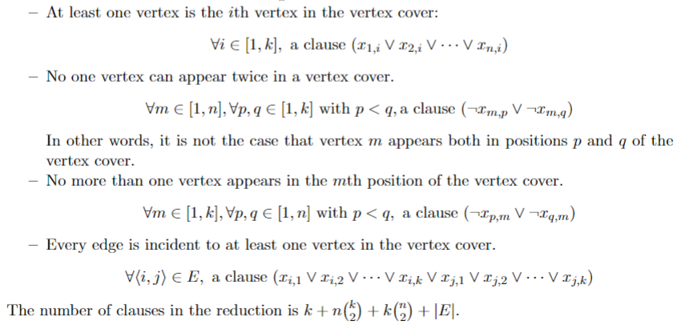

# Vertex Cover Analysis

## Purpose
Analyzed algorithmic efficiency of three approaches to solving the Minimum Vertex Cover for undirected graphs of various sizes. For a comprehensive breakdown of this experiment, please refer to "Vertex_Cover_Report.pdf" within this repository.

## Definitions
**Undirected Graph:** a set of objects (called vertices or nodes) that are connected together, where all the edges are bidirectional.

**Vertice:** the fundamental unit by which graphs are formed.

**Edge:** a bidirectional line which connects an unordered pair of vertices together.

**Minimum Vertex Cover:** the smallest possible subset of vertices of an undirected graph such that every edge in the graph has at least one endpoint in the vertex cover.

## Encoding


**_Note:_** _encoding provided by the University of Waterloo, Department of Electrical and Computer Engineering, Reza Babaee/Arie Gurfinkel_

## Project Setup
Clone the MiniSAT repository into the top level directory of the project using:
```
git clone https://github.com/agurfinkel/minisat.git
```
Install CMake:
```
sudo apt install cmake
```
To initiate the build sequence from scratch, use:
```
$ cd Vertex_Cover_Analysis && mkdir build && cd build && cmake ../ && make
```
To run the program:
```
$ cd Vertex_Cover_Analysis/build/
./analysis
```

## Commands
To specify the maximum number of vertices in the graph: 
```
V 10
```
To specify the edge list for the graph: 
```
E {<1,2>,<7,1>,<3,6>,<4,6>,<0,7>,<2,8>,<0,9>,<5,4>,<8,4>,<2,4>,<3,4>,<0,6>,<4,1>,<9,1>,<6,5>}
```

## Example

**Input:**
```
V 10
E {<1,2>,<7,1>,<3,6>,<4,6>,<0,7>,<2,8>,<0,9>,<5,4>,<8,4>,<2,4>,<3,4>,<0,6>,<4,1>,<9,1>,<6,5>}
```
**Output:**
```
Vertex Cover for CNF-SAT-VC: 2,4,6,7,9
Vertex Cover for APPROX-VC-1: 0,1,2,4,6
Vertex Cover for APPROX-VC-2: 0,1,2,3,4,5,6,7

CNF-SAT-VC Runtime: 46646.3 microseconds
APPROX-VC-1 Runtime: 139.341 microseconds
APPROX-VC-2 Runtime: 112.531 microseconds

Approximation Ratio for APPROX-VC-1:  1.00
Approximation Ratio for APPROX-VC-2:  1.60
```
